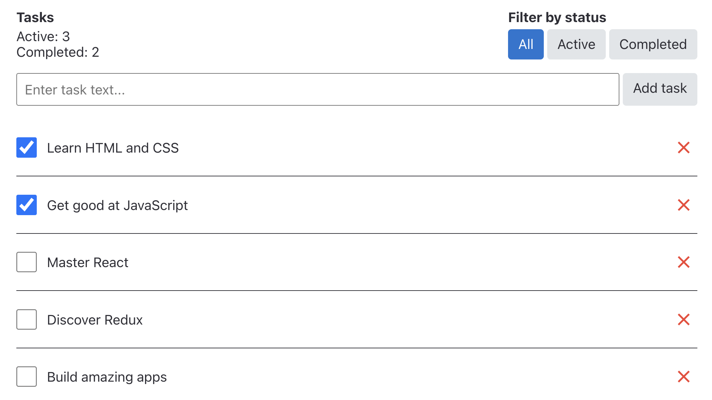

## Preparing for work

1. Make sure that the LTS version of Node.js is installed on the computer.
   [Download and install](https://nodejs.org/en/) if necessary.
2. Install the project's basic dependencies using the `npm install` command.
3. Start the development mode, execute the `npm start` command.
4. Go to [http://localhost:3000](http://localhost:3000) in the browser. This
   page will automatically reload after saving the changes project files.

---

### Task scheduler

Basic requirements for the interface and logic of the program:

_The interface should consist of several parts:_

- A header displaying information about tasks and filters
- A form with an input field for creating new tasks
- A list of tasks

_The header must display:_

- The number of completed and uncompleted tasks
- Task list filters with options for "All," "Active," and "Completed"

_Each task list item should include:_

- A paragraph with the text entered by the user when creating the task
- A checkbox for toggling the task's status to "done"
- A delete task button

The ultimate objective is to develop an application with an interface resembling
this.

